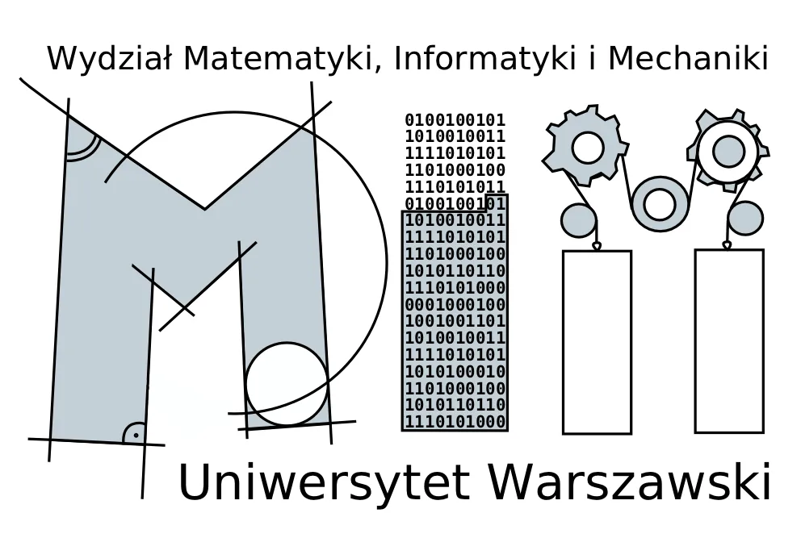

Hi, there ! My name is Janusz Nowak, let share few words about me :)

I Graduated 2008 [University of Warsaw](https://uw.edu.pl/), Faculty of Mathematics, Informatics and Mechanics [MIMUW](https://www.mimuw.edu.pl/) where I study computer science.

I am a Software Developer/Architect with over 15 years of experience, flustered with approach "It works on my computer"
use DevOps practice for over 11 years, natural path going Cloud 7 years.

I am passionate about Lean, DevOps, Application Life Cycle Management, Cloud, Server less and Infrastructure as Code. I try to share knowledge, expertise. Involved in many different activities, like this blog, workshops/session/event/online videos/community meetings/conferences speaking/creating software/open source.

You can find lates activities on profile [blog](https://blog.janono.pl/), [linkedin](https://www.linkedin.com/in/janono/),
[twitter](https://twitter.com/jnowwwak), [github](https://github.com/janusznowak), [youtube](https://www.youtube.com/c/JanuszNowakjanono), [stackoverflow](https://stackoverflow.com/users/1878728/janusz-nowak)

Here are few of certifications, awards and honors I received.

<h2>Azure Cloud</h2>

<a href='https://www.credly.com/badges/a785cc0c-005d-4353-a572-f083b1a444c6' title='Microsoft Certified: Azure Solutions Architect Expert,Earning the Azure Solutions Architect Expert certification demonstrates subject matter expertise in designing cloud and hybrid solutions that run on Microsoft Azure, including compute, network, storage, monitoring, and security. Candidates have advanced experience and knowledge across IT operations, including networking, virtualization, identity, security, business continuity, disaster recovery, data platforms, and governance.'></a>

<a href='https://www.credly.com/badges/5f858f16-6edd-4ca6-b2da-a67ed72ce8de' title='Microsoft Certified: Azure Administrator Associate (Legacy),Earning Azure Administrator Associate certification validates the skills and knowledge to implement, manage, and monitor an organization’s Microsoft Azure environment. Candidates have a deep understanding of each implementing, managing, and monitoring identity, governance, storage, compute, and virtual networks in a cloud environment, plus provision, size, monitor, and adjust resources, when needed.'></a>

<a href='https://www.credly.com/badges/349698db-dda6-4f8a-8a8e-c73d881691d2' title='Microsoft Certified: Azure Administrator Associate,Earning Azure Administrator Associate certification validates the skills and knowledge to implement, manage, and monitor an organization’s Microsoft Azure environment. Candidates have a deep understanding of each implementing, managing, and monitoring identity, governance, storage, compute, and virtual networks in a cloud environment, plus provision, size, monitor, and adjust resources, when needed.'></a>

<a href='https://www.credly.com/badges/f7af26cb-43fc-4392-89e0-58eaa52e7f4d' title='Microsoft Certified: Azure Database Administrator Associate,Earning the Database Administrator Associate certification validates the skills and knowledge to implement and manage the operational aspects of cloud-native and hybrid data platform solutions built on Microsoft Azure data services and Microsoft SQL Server. The Azure Database Administrator uses a variety of methods and tools to perform day-to-day operations, including applying knowledge of using T-SQL for administrative management purposes.'></a>

<a href='https://www.credly.com/badges/a790c393-8fbf-4a8d-83b4-bc235d123451' title='Microsoft Certified: Power BI Data Analyst Associate,Earning the Power BI Data Analyst Associate certification validates the skills and knowledge required to enable businesses to maximize the value of their data assets by using Microsoft Power BI. As a subject matter expert, Data Analysts are responsible for designing and building scalable data models, cleaning and transforming data, and enabling advanced analytic capabilities that provide meaningful business value through easy-to-comprehend data visualizations.'></a>

<a href='https://www.credly.com/badges/9bd2d44f-2809-40a9-a7e0-321349378a67' title='Microsoft Certified: Azure Data Engineer Associate,Earning the Azure Data Engineer Associate certification validates the skills and expertise in integrating, transforming, and consolidating data from various structured and unstructured data systems into structures that are suitable for building analytics solutions. Candidates have a solid knowledge of data processing languages, such as SQL, Python, or Scala, and they need to understand parallel processing and data architecture patterns.'></a>

<a href='https://www.credly.com/badges/6e529208-a700-46ad-ba40-7f0ca2acf5cb' title='Microsoft Certified: Azure IoT Developer Specialty,Earning the Microsoft Certified: Azure IoT Developer Specialty certification validates experience and knowledge for the implementation and the coding required to create and maintain the cloud and edge portion of an IoT solution. In addition to configuring and maintaining the devices by using cloud services, the IoT Developer also sets up the physical devices. The IoT Developer is responsible for maintaining the devices throughout the life cycle.'></a>

<a href='https://www.credly.com/badges/cd0fb360-f8d7-422f-bbe7-c81cb35a9159' title='Microsoft Certified Trainer 2022-2023,Many of Microsoft’s software and technologies are technically complex, and professionals may require training from knowledgeable trainers in aspects of their use. In order to make such training generally available, Microsoft has developed the Microsoft Certified Trainer (MCT) Program which grants membership to professional trainers and learning consultants who demonstrate and maintain technical and instructional expertise on Microsoft technologies and who have complied with all requirements.'></a>

<a href='https://www.credly.com/badges/b78247bb-6482-4412-8e04-e33aa6d8c7c3' title='Microsoft Certified Trainer 2021-2022,Many of Microsoft’s software and technologies are technically complex, and professionals may require training from knowledgeable trainers in aspects of their use. In order to make such training generally available, Microsoft has developed the Microsoft Certified Trainer (MCT) Program which grants membership to professional trainers and learning consultants who demonstrate and maintain technical and instructional expertise on Microsoft technologies and who have complied with all requirements.'></a>

<a href='https://www.credly.com/badges/ac452bc7-3c68-43d5-ae13-5fe5fc3556d9' title='AZ-400: Designing and Implementing Microsoft DevOps Solutions,Passing exam AZ-400: Designing and Implementing Microsoft DevOps Solutions validates the skills and knowledge to combine people, processes, and technologies to deliver valuable products and services that meet end-user needs and business objectives. Candidates optimize practices, improve communications, and create automation to streamline delivery. They design and implement strategies for application code and infrastructure for continuous integration, testing, delivery, monitoring and feedback.'></a>

<a href='https://www.credly.com/badges/fbbd29e6-8f04-42aa-ba9a-46158e174368' title='AZ-304: Microsoft Azure Architect Design,Passing Exam AZ-304: Microsoft Azure Architect Design validates the skills and knowledge to advise stakeholders and translate business requirements into secure, scalable, and reliable cloud solutions. Candidates have advanced experience and knowledge across IT operations, including networking, virtualization, identity, security, business continuity, disaster recovery, data platform, budgeting, and governance. *This exam is now retired.'></a>

<a href='https://www.credly.com/badges/4960814b-d3a8-4b8a-85e5-91a5947a1a6a' title='AZ-303: Microsoft Azure Architect Technologies,Passing Exam AZ-303: Microsoft Azure Architect Technologies validates the skills and knowledge to advise stakeholders and translate business requirements into secure, scalable, and reliable cloud solutions. Candidates have advanced experience and knowledge across IT operations, including networking, virtualization, identity, security, business continuity, disaster recovery, data platform, budgeting, and governance. *This exam is now retired.'></a>

<a href='https://www.credly.com/badges/c1e98c2e-3393-43e6-a0a9-273eba260860' title='DP-201 Designing an Azure Data Solution,Passing exam DP-201 validates the skills and knowledge to design Azure data storage solutions that use relational and non-relational data stores, batch and real-time data processing, and data security and compliance solutions. Earners are able to implement data solutions that use the following Azure services: Azure Cosmos DB, Azure SQL Database and Data Warehouse, Azure Data Lake Storage and Data Factory, Azure Stream Analytics, Databricks, and Azure Blob storage. *This exam is now retired.'></a>

<a href='https://www.credly.com/badges/130f2a7c-80d0-4514-ade5-58bbe3435111' title='DP-200 Implementing an Azure Data Solution,Passing exam DP-200 Implementing an Azure Data Solution validates the skills and knowledge to implement security requirements, data retention policies, identify performance bottlenecks, and access external data sources. Earners are able to implement data solutions that use the following Azure services: Azure Cosmos DB, Azure SQL Database and Data Warehouse, Azure Data Lake Storage and Data Factory, Azure Stream Analytics and Databricks, and Azure Blob storage. *This exam is now retired.'></a>

<a href='https://www.credly.com/badges/bf60eeb8-cb20-4e53-a834-4c389fdef54e' title='OpenHack: DevOps,Earners of the OpenHack: DevOps badge have fundamental understanding of the DevOps practices required to achieve zero downtime deployment of containerized micro-services running in Azure. The scenario is a real-world simulation focused on DevOps practices including Continuous Integration, Testing, Delivery, Monitoring and Security. Participants improve delivery velocity and release quality while minimizing downtime using DevOps tools including but not limited to GitHub, Azure DevOps, and Bicep.'></a>

<h2>Azure Hero</h2>

<h2>DevOps</h2>

<h2>Safe</h2>

<a href='https://www.credly.com/badges/f157c780-f611-463f-8090-3221ca4dcf3c' title='Certified SAFe® 5 Architect,A Certified SAFe® 5 Architect (ARCH) is an effective leader and change agent who delivers Agile Architecture to enable the creation of business value. Key areas of competency include applying SAFe principles to develop and maintain Agile Architecture and release on demand, leading and supporting Solution Trains and Agile Release Trains, extending the principles driving continuous flow to large systems-of-systems, and enabling improved flow of value.'></a>

<a href='https://www.credly.com/badges/39ddf242-16e4-4a4d-b4d6-cbed09689475' title='Certified SAFe® 5 DevOps Practitioner,A Certified SAFe® 5 DevOps Practitioner (SDP) is a SAFe professional responsible for improving the complete flow of value through a Continuous Delivery Pipeline from idea to operational solution. Key areas of responsibility include participating in Continuous Exploration, Continuous Integration, Continuous Deployment, Release-on-Demand, continuous testing, continuous security, and building a culture of shared responsibility.'></a>

<a href='https://www.credly.com/badges/3414be8a-af82-4209-a407-3fe6e8e92e26' title='Certified SAFe® 5 Practitioner,A Certified SAFe® 5 Practitioner (SP) is a SAFe team member professional responsible for using Scrum, Kanban, and XP in a SAFe environment. Key areas of responsibility include planning Program Increments and iterations, breaking requirements into stories, developing incrementally with built-in quality, demoing value at a team and program level, and problem solving impediments to drive relentless improvement.'></a>

<h2>P&G</h2>

<h2>NN/G</h2>

